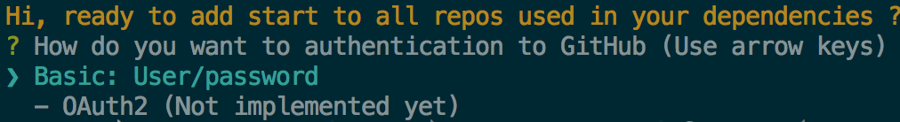
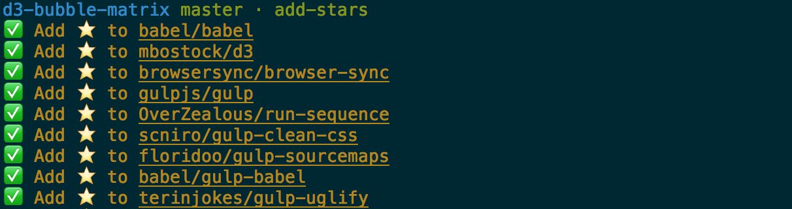

# add-stars

Add stars to all the repos in GitHub used in package.json.

[](https://nodei.co/npm/add-stars/)

## Install

```bash
$ npm i -g add-stars
```

## Setup

```bash
$ add-stars
```

#### Add authentication information for GitHub



#### Add stars to all the repos



#### Add stars recursive 🌟, stars all the repos in node_modules

```bash
$ add-stars -r
```

#### Reset authentication
```bash
$ add-stars -a
```

#### Add star to this repo 👍
```bash
$ add-stars -s
```

#### Help
```bash
$ add-stars -h
```
