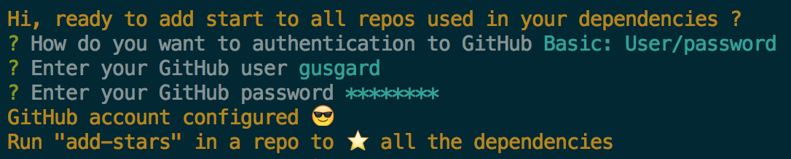

# add-stars

Add stars to all the repos in GitHub used in package.json.

## Install

```bash
$ npm i -g add-stars
```

## Setup

```bash
$ add-stars
```

#### Add authentication information for GitHub



#### Add stars to all the repos


#### Reset authentication
```bash
$ add-stars -a
```

#### Star this repo 👍
```bash
$ add-stars -s
```

#### Help
```bash
$ add-stars -h
```

<!-- ### Features

- Recursive mode. add stars for all the repos used to build this project. -->
